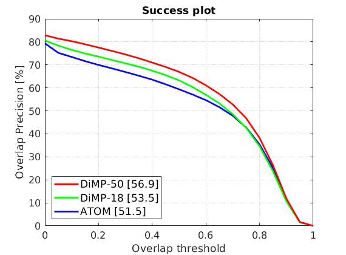
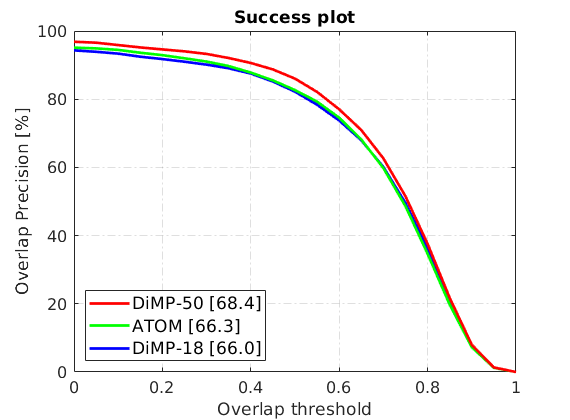
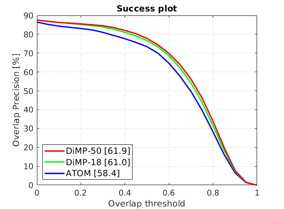
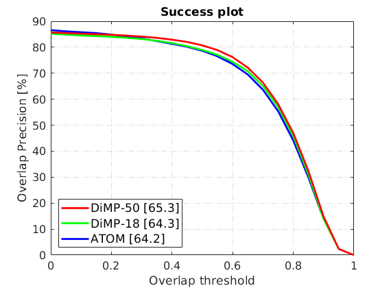

# PyTracking Model Zoo

Here, we provide a number of tracker models trained using PyTracking. We also report the results
of the models on standard tracking datasets.  

<table>
  <tr>
    <th>Model</th>
    <th>VOT18 EAO (%)</th>
    <th>OTB100 AUC (%)</th>
    <th>NFS AUC (%)</th>
    <th>UAV123 AUC (%)</th>
    <th>LaSOT AUC (%)</th>
    <th>TrackingNet AUC (%)</th>
    <th>GOT-10k AO (%)</th>
    <th>Links</th>
  </tr>
  <tr>
    <td>ATOM</td>
    <td>0.401</td>
    <td>66.3</td>
    <td>58.4</td>
    <td>64.2</td>
    <td>51.5</td>
    <td>70.3</td>
    <td>55.6</td>
    <td><a href="https://drive.google.com/open?id=1VNyr-Ds0khjM0zaq6lU-xfY74-iWxBvU">model</a> | <a href="https://drive.google.com/drive/folders/1MdJtsgr34iJesAgL7Y_VelP8RvQm_IG_">results</a></td>
  </tr>
  <tr>
    <td>DiMP-18</td>
    <td>0.402</td>
    <td>66.0</td>
    <td>61.0</td>
    <td>64.3</td>
    <td>53.5</td>
    <td>72.3</td>
    <td>57.9</td>
    <td><a href="https://drive.google.com/open?id=1MAjrRJDCbL0DSjUKFyDkUuYS1-cYBNjk">model</a> | <a href="https://drive.google.com/drive/folders/1xS-Mp4o4ud0qOnmn4mG0UMcMHb2jIrO9">results</a></td>
  </tr>
  <tr>
    <td>DiMP-50</td>
    <td>0.440</td>
    <td>68.4</td>
    <td>61.9</td>
    <td>65.3</td>
    <td>56.9</td>
    <td>74.0</td>
    <td>61.1</td>
    <td><a href="https://drive.google.com/open?id=1qgachgqks2UGjKx-GdO1qylBDdB1f9KN">model</a> | <a href="https://drive.google.com/drive/folders/1dmy3gX7kz6kSokQZcCX4gXwxyTc_7bXK">results</a></td>
  </tr>
</table>

**Note:** The raw results are in the format [top_left_x, top_left_y, width, height]. 
Due to the stochastic nature of the trackers, the results reported here are an average over multiple runs. 
For OTB-100, NFS, UAV123, and LaSOT, the results were averaged over 5 runs. For VOT2018, 15 runs were used 
as per the VOT protocol. As TrackingNet results are obtained using the online evaluation server, only a 
single run was used for TrackingNet. For GOT-10k, 3 runs are used as per protocol.

## Plots
The success plots for our trained models on the standard tracking datasets are shown below.  

#### LaSOT
  

#### OTB-100
  

#### NFS
  

#### UAV123
  