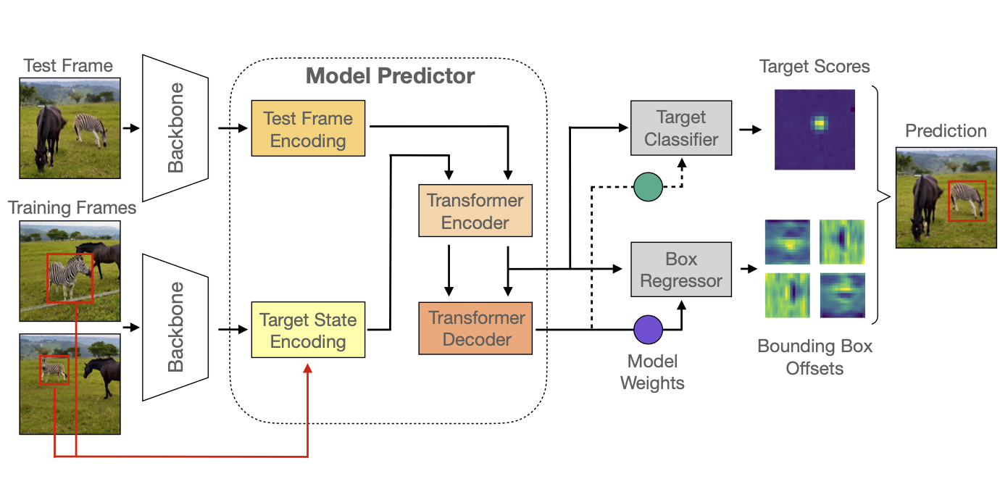
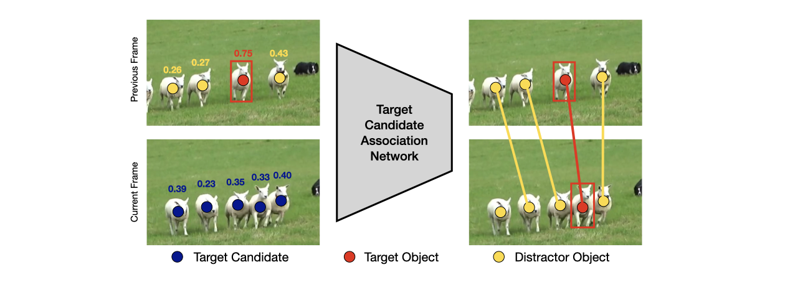
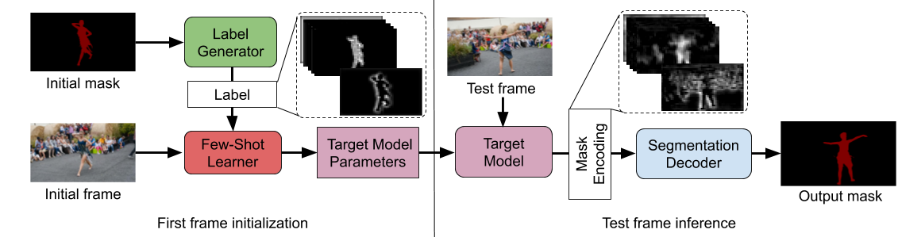
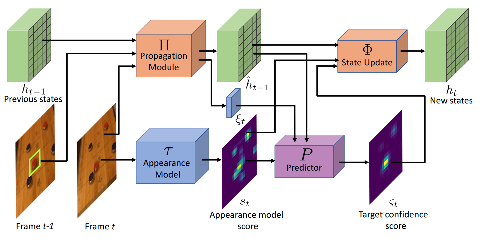
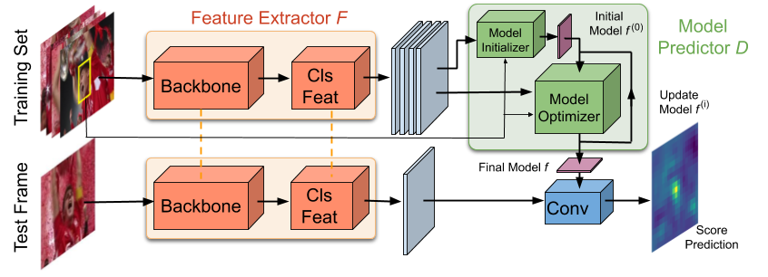

# PyTracking
A general python framework for visual object tracking and video object segmentation, based on **PyTorch**.

### :fire: One tracking paper accepted at CVPR 2022! 👇
* [Transforming Model Prediction for Tracking](https://arxiv.org/abs/2203.11192) | **Code available!**

### Two tracking/VOS papers accepted at ICCV 2021!
* [Learning Target Candidate Association to Keep Track of What Not to Track](https://arxiv.org/abs/2103.16556) | **Code available!**  
* [Generating Masks from Boxes by Mining Spatio-Temporal Consistencies in Videos](https://arxiv.org/abs/2101.02196) | Code coming here soon...  


## Highlights

### ToMP, KeepTrack, LWL, KYS, PrDiMP, DiMP and ATOM Trackers

Official implementation of the **ToMP** (CVPR 2022), **KeepTrack** (ICCV 2021), **LWL** (ECCV 2020), **KYS** (ECCV 2020), **PrDiMP** (CVPR 2020), 
**DiMP** (ICCV 2019), and **ATOM** (CVPR 2019) trackers, including complete **training code** and trained models.

### [Tracking Libraries](pytracking)

Libraries for implementing and evaluating visual trackers. It includes

* All common **tracking** and **video object segmentation** datasets.  
* Scripts to **analyse** tracker performance and obtain standard performance scores.
* General building blocks, including **deep networks**, **optimization**, **feature extraction** and utilities for **correlation filter** tracking.  

### [Training Framework: LTR](ltr)
 
**LTR** (Learning Tracking Representations) is a general framework for training your visual tracking networks. It is equipped with

* All common **training datasets** for visual object tracking and segmentation.  
* Functions for data **sampling**, **processing** etc.  
* Network **modules** for visual tracking.
* And much more...


### [Model Zoo](MODEL_ZOO.md)
The tracker models trained using PyTracking, along with their results on standard tracking 
benchmarks are provided in the [model zoo](MODEL_ZOO.md). 


## Trackers
The toolkit contains the implementation of the following trackers.

### ToMP (CVPR 2022)

**[[Paper]](https://arxiv.org/abs/2203.11192) [[Raw results]](MODEL_ZOO.md#Raw-Results-1)
  [[Models]](MODEL_ZOO.md#Models-1) [[Training Code]](./ltr/README.md#ToMP)  [[Tracker Code]](./pytracking/README.md#ToMP)**

Official implementation of **ToMP**. ToMP employs a Transformer-based 
model prediction module in order to localize the target. The model predictor is further exteneded to estimate a second set
of weights that are applied for accurate bounding box regression.
The resulting tracker ToMP relies on training and on test frame information in order to predict all weights transductively.



### KeepTrack (ICCV 2021)

**[[Paper]](https://arxiv.org/abs/2103.16556)  [[Raw results]](MODEL_ZOO.md#Raw-Results-1)
  [[Models]](MODEL_ZOO.md#Models-1)  [[Training Code]](./ltr/README.md#KeepTrack)  [[Tracker Code]](./pytracking/README.md#KeepTrack)**

Official implementation of **KeepTrack**. KeepTrack actively handles distractor objects to
continue tracking the target. It employs a learned target candidate association network, that
allows to propagate the identities of all target candidates from frame-to-frame.
To tackle the problem of lacking groundtruth correspondences between distractor objects in visual tracking,
it uses a training strategy that combines partial annotations with self-supervision. 




### LWL (ECCV 2020)
**[[Paper]](https://arxiv.org/pdf/2003.11540.pdf)  [[Raw results]](MODEL_ZOO.md#Raw-Results-1)
  [[Models]](MODEL_ZOO.md#Models-1)  [[Training Code]](./ltr/README.md#LWL)  [[Tracker Code]](./pytracking/README.md#LWL)**
    
Official implementation of the **LWL** tracker. LWL is an end-to-end trainable video object segmentation architecture
which captures the current target object information in a compact parametric
model. It integrates a differentiable few-shot learner module, which predicts the
target model parameters using the first frame annotation. The learner is designed
to explicitly optimize an error between target model prediction and a ground
truth label. LWL further learns the ground-truth labels used by the
few-shot learner to train the target model. All modules in the architecture are trained end-to-end by maximizing segmentation accuracy on annotated VOS videos. 



### KYS (ECCV 2020)
**[[Paper]](https://arxiv.org/pdf/2003.11014.pdf)  [[Raw results]](MODEL_ZOO.md#Raw-Results)
  [[Models]](MODEL_ZOO.md#Models)  [[Training Code]](./ltr/README.md#KYS)  [[Tracker Code]](./pytracking/README.md#KYS)**
    
Official implementation of the **KYS** tracker. Unlike conventional frame-by-frame detection based tracking, KYS 
propagates valuable scene information through the sequence. This information is used to
achieve an improved scene-aware target prediction in each frame. The scene information is represented using a dense 
set of localized state vectors. These state vectors are propagated through the sequence and combined with the appearance
model output to localize the target. The network is learned to effectively utilize the scene information by directly maximizing tracking performance on video segments


### PrDiMP (CVPR 2020)
**[[Paper]](https://arxiv.org/pdf/2003.12565)  [[Raw results]](MODEL_ZOO.md#Raw-Results)
  [[Models]](MODEL_ZOO.md#Models)  [[Training Code]](./ltr/README.md#PrDiMP)  [[Tracker Code]](./pytracking/README.md#DiMP)**
    
Official implementation of the **PrDiMP** tracker. This work proposes a general 
formulation for probabilistic regression, which is then applied to visual tracking in the DiMP framework.
The network predicts the conditional probability density of the target state given an input image.
The probability density is flexibly parametrized by the neural network itself.
The regression network is trained by directly minimizing the Kullback-Leibler divergence. 

### DiMP (ICCV 2019)
**[[Paper]](https://arxiv.org/pdf/1904.07220)  [[Raw results]](MODEL_ZOO.md#Raw-Results)
  [[Models]](MODEL_ZOO.md#Models)  [[Training Code]](./ltr/README.md#DiMP)  [[Tracker Code]](./pytracking/README.md#DiMP)**
    
Official implementation of the **DiMP** tracker. DiMP is an end-to-end tracking architecture, capable
of fully exploiting both target and background appearance
information for target model prediction. It is based on a target model prediction network, which is derived from a discriminative
learning loss by applying an iterative optimization procedure. The model prediction network employs a steepest descent 
based methodology that computes an optimal step length in each iteration to provide fast convergence. The model predictor also
includes an initializer network that efficiently provides an initial estimate of the model weights.  


 
### ATOM (CVPR 2019)
**[[Paper]](https://arxiv.org/pdf/1811.07628)  [[Raw results]](MODEL_ZOO.md#Raw-Results)
  [[Models]](MODEL_ZOO.md#Models)  [[Training Code]](./ltr/README.md#ATOM)  [[Tracker Code]](./pytracking/README.md#ATOM)**  
 
Official implementation of the **ATOM** tracker. ATOM is based on 
(i) a **target estimation** module that is trained offline, and (ii) **target classification** module that is 
trained online. The target estimation module is trained to predict the intersection-over-union (IoU) overlap 
between the target and a bounding box estimate. The target classification module is learned online using dedicated 
optimization techniques to discriminate between the target object and background.
 

 
### ECO/UPDT (CVPR 2017/ECCV 2018)
**[[Paper]](https://arxiv.org/pdf/1611.09224.pdf)  [[Models]](https://drive.google.com/open?id=1aWC4waLv_te-BULoy0k-n_zS-ONms21S)  [[Tracker Code]](./pytracking/README.md#ECO)**  

An unofficial implementation of the **ECO** tracker. It is implemented based on an extensive and general library for [complex operations](pytracking/libs/complex.py) and [Fourier tools](pytracking/libs/fourier.py). The implementation differs from the version used in the original paper in a few important aspects. 
1. This implementation uses features from vgg-m layer 1 and resnet18 residual block 3.   
2. As in our later [UPDT tracker](https://arxiv.org/pdf/1804.06833.pdf), seperate filters are trained for shallow and deep features, and extensive data augmentation is employed in the first frame.  
3. The GMM memory module is not implemented, instead the raw projected samples are stored.  

Please refer to the [official implementation of ECO](https://github.com/martin-danelljan/ECO) if you are looking to reproduce the results in the ECO paper or download the raw results.


## Installation

#### Clone the GIT repository.  
```bash
git clone https://github.com/visionml/pytracking.git
```
   
#### Clone the submodules.  
In the repository directory, run the commands:  
```bash
git submodule update --init  
```  
#### Install dependencies
Run the installation script to install all the dependencies. You need to provide the conda install path (e.g. ~/anaconda3) and the name for the created conda environment (here ```pytracking```).  
```bash
bash install.sh conda_install_path pytracking
```  
This script will also download the default networks and set-up the environment.  

**Note:** The install script has been tested on an Ubuntu 18.04 system. In case of issues, check the [detailed installation instructions](INSTALL.md). 

**Windows:** (NOT Recommended!) Check [these installation instructions](INSTALL_win.md). 

#### Let's test it!
Activate the conda environment and run the script pytracking/run_webcam.py to run ATOM using the webcam input.  
```bash
conda activate pytracking
cd pytracking
python run_webcam.py dimp dimp50    
```  


## What's next?

#### [pytracking](pytracking) - for implementing your tracker

#### [ltr](ltr) - for training your tracker

## Contributors

### Main Contributors
* [Martin Danelljan](https://martin-danelljan.github.io/)  
* [Goutam Bhat](https://goutamgmb.github.io/)
* [Christoph Mayer](https://2006pmach.github.io/)

### Guest Contributors
* [Felix Järemo-Lawin](https://liu.se/en/employee/felja34) [LWL]

## Acknowledgments
* Thanks for the great [PreciseRoIPooling](https://github.com/vacancy/PreciseRoIPooling) module.  
* We use the implementation of the Lovász-Softmax loss from https://github.com/bermanmaxim/LovaszSoftmax.  
