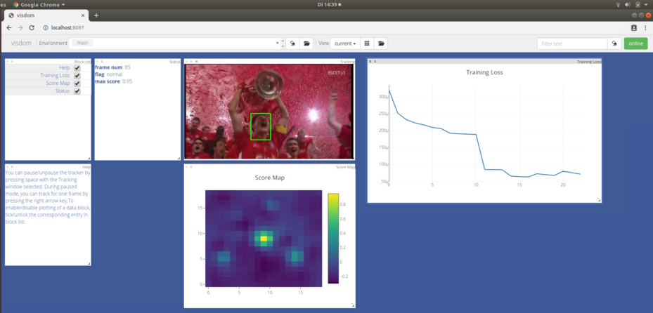

# PyTracking

A general python library for visual tracking algorithms. 
## Table of Contents

* [Running a tracker](#running-a-tracker)
* [Overview](#overview)
* [Trackers](#trackers)
   * [DiMP](#DiMP)
   * [ATOM](#ATOM)
   * [ECO](#ECO)
* [Libs](#libs)
* [Visdom](#visdom)
* [VOT Integration](#vot-integration)
* [Integrating a new tracker](#integrating-a-new-tracker)


## Running a tracker
The installation script will automatically generate a local configuration file  "evaluation/local.py". In case the file was not generated, run ```evaluation.environment.create_default_local_file()``` to generate it. Next, set the paths to the datasets you want
to use for evaluations. You can also change the path to the networks folder, and the path to the results folder, if you do not want to use the default paths. If all the dependencies have been correctly installed, you are set to run the trackers.  

The toolkit provides many ways to run a tracker.  

**Run the tracker on webcam feed**   
This is done using the run_webcam script. The arguments are the name of the tracker, and the name of the parameter file.  
```bash
python run_webcam.py tracker_name parameter_name    
```  

**Run the tracker on some dataset sequence**  
This is done using the run_tracker script. 
```bash
python run_tracker.py tracker_name parameter_name --dataset_name dataset_name --sequence sequence --debug debug --threads threads
```  

Here, the dataset_name can be either ```'otb'``` (OTB-2015), ```'nfs'``` (Need for Speed), ```'uav'``` (UAV123), ```'tpl'``` (Temple128), ```'tn'``` (TrackingNet test set), ```'gott'``` (GOT-10k test set), 
```'gotv'``` (GOT-10k val set), ```'lasot'``` (LaSOT) or ```'vot'``` (VOT2018). The sequence can either be an integer denoting the index of the sequence in the dataset, or the name of the sequence, e.g. ```'Soccer'```.
The ```debug``` parameter can be used to control the level of debug visualizations. ```threads``` parameter can be used to run on multiple threads.

**Run the tracker on a set of datasets**  
This is done using the run_experiment script. To use this, first you need to create an experiment setting file in ```pytracking/experiments```. See [myexperiments.py](experiments/myexperiments.py) for reference. 
```bash
python run_experiment.py experiment_module experiment_name --dataset_name dataset_name --sequence sequence  --debug debug --threads threads
```  
Here, ```experiment_module```  is the name of the experiment setting file, e.g. ```myexperiments``` , and ``` experiment_name```  is the name of the experiment setting, e.g. ``` atom_nfs_uav``` .

**Run the tracker on a video file**  
This is done using the run_video script.  
```bash
python run_video.py experiment_module experiment_name videofile --optional_box optional_box --debug debug
```  
Here, ```videofile```  is the path to the video file. You can either draw the box by hand or provide it directly in the ```optional_box``` argument.

## Overview
The tookit consists of the following sub-modules.  
 -  [evaluation](evaluation): Contains the necessary scripts for running a tracker on a dataset. It also contains integration of a number of standard tracking datasets, namely  [OTB-100](http://cvlab.hanyang.ac.kr/tracker_benchmark/index.html), [NFS](http://ci2cv.net/nfs/index.html),
 [UAV123](https://ivul.kaust.edu.sa/Pages/pub-benchmark-simulator-uav.aspx), [Temple128](http://www.dabi.temple.edu/~hbling/data/TColor-128/TColor-128.html), [TrackingNet](https://tracking-net.org/), [GOT-10k](http://got-10k.aitestunion.com/), [LaSOT](https://cis.temple.edu/lasot/), [VOT2018](http://www.votchallenge.net/vot2018/), and [Temple Color 128](http://www.dabi.temple.edu/~hbling/data/TColor-128/TColor-128.html).  
 - [experiments](experiments): The experiment setting files must be stored here,  
 - [features](features): Contains tools for feature extraction, data augmentation and wrapping networks.  
 - [libs](libs): Includes libraries for optimization, dcf, etc.  
 - [parameter](parameter): Contains the parameter settings for different trackers.  
 - [tracker](tracker): Contains the implementations of different trackers.  
 - [utils](utils): Some util functions. 
 - [VOT](vot): VOT Integration.  
 
## Trackers
 The toolkit contains the implementation of the following trackers.  

### DiMP
The official implementation for the DiMP tracker ([paper](https://arxiv.org/abs/1904.07220)). 
The tracker implementation file can be found at [tracker.dimp](tracker/dimp). 

##### Parameter Files
Four parameter settings are provided. These can be used to reproduce the results or as a starting point for your exploration.  
* **[dimp18](parameter/dimp/dimp18.py)**: The default parameter setting with ResNet-18 backbone which was used to produce all DiMP-18 results in the paper, except on VOT.  
* **[dimp18_vot](parameter/dimp/dimp18_vot.py)**: The parameters settings used to generate the DiMP-18 VOT2018 results in the paper.  
* **[dimp50](parameter/dimp/dimp50.py)**: The default parameter setting with ResNet-50 backbone which was used to produce all DiMP-50 results in the paper, except on VOT.  
* **[dimp50_vot](parameter/dimp/dimp50_vot.py)**: The parameters settings used to generate the DiMP-50 VOT2018 results in the paper.  

The difference between the vot and the non-vot settings stems from the fact that the VOT protocol measures robustness in a very different manner compared to other benchmarks. In most benchmarks, it is highly important to be able to robustly *redetect* the target after e.g. an occlusion or brief target loss. On the other hand, in VOT the tracker is reset if the prediction does not overlap with the target on a *single* frame. This is then counted as a tracking failure. The capability of recovering after target loss is meaningless in this setting. The ```dimp18_vot``` and ```dimp50_vot``` settings thus focuses on avoiding target loss in the first place, while sacrificing re-detection ability. 
 
### ATOM
The official implementation for the ATOM tracker ([paper](https://arxiv.org/abs/1811.07628)). 
The tracker implementation file can be found at [tracker.atom](tracker/atom).  
 
##### Parameter Files
Two parameter settings are provided. These can be used to reproduce the results or as a starting point for your exploration.  
* **[default](parameter/atom/default.py)**: The default parameter setting that was used to produce all ATOM results in the paper, except on VOT.  
* **[default_vot](parameter/atom/default_vot.py)**: The parameters settings used to generate the VOT2018 results in the paper.  

The difference between these two settings stems from the fact that the VOT protocol measures robustness in a very different manner compared to other benchmarks.
 
### ECO
An unofficial implementation of the ECO tracker can be found at [tracker.eco](tracker/eco). 

## Libs
The pytracking repository includes some general libraries for implementing and developing different kinds of visual trackers, including deep learning based, optimization based and correlation filter based. The following libs are included:

* [**Optimization**](libs/optimization.py): Efficient optimizers aimed for online learning, including the Gauss-Newton and Conjugate Gradient based optimizer used in ATOM.
* [**Complex**](libs/complex.py): Complex tensors and operations for PyTorch, which can be used for DCF trackers.
* [**Fourier**](libs/fourier.py): Fourier tools and operations, which can be used for implementing DCF trackers.
* [**DCF**](libs/dcf.py): Some general tools for DCF trackers.

## Visdom

All trackers support [Visdom](https://github.com/facebookresearch/visdom) for debug visualizations. To use visdom, start the visdom
server from a seperate command line: 

```bash
visdom
```  

Run the tracker with the ```debug``` argument > 0. The debug output from the tracker can be 
accessed by going to ```http://localhost:8097``` in your browser. Further, you can pause the execution of the tracker,
or step through frames using keyboard inputs. 



## VOT Integration
An example configuration file to integrate the trackers in the [VOT toolkit](https://github.com/votchallenge/vot-toolkit) is provided at [VOT/tracker_DiMP.m](VOT/tracker_DiMP.m). 
Copy the configuration file to your VOT workspace and set the paths in the configuration file. You need to install [TraX](https://github.com/votchallenge/trax) 
in order to run the trackers on VOT. This can be done with the following commands.

```bash
cd VOT_TOOLKIT_PATH/native/trax
mkdir build
cd build
cmake -DBUILD_OPENCV=ON -DBUILD_CLIENT=ON ..
make   
``` 

See https://trax.readthedocs.io/en/latest/index.html for more details about TraX.

## Integrating a new tracker  
 To implement a new tracker, create a new module in "tracker" folder with name your_tracker_name. This folder must contain the implementation of your tracker. Note that your tracker class must inherit from the base tracker class ```tracker.base.BaseTracker```.
 The "\_\_init\_\_.py" inside your tracker folder must contain the following lines,  
```python
from .tracker_file import TrackerClass

def get_tracker_class():
    return TrackerClass
```
Here, ```TrackerClass``` is the name of your tracker class. See the [file for ATOM](tracker/atom/__init__.py) as reference.

Next, you need to create a folder "parameter/your_tracker_name", where the parameter settings for the tracker should be stored. The parameter fil shall contain a ```parameters()``` function that returns a ```TrackerParams``` struct. See the [default parameter file for ATOM](parameter/atom/default.py) as an example.

 
 
